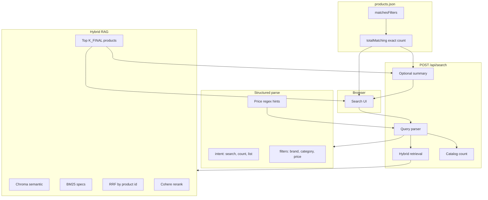

# Hybrid RAG E-commerce Search

Next.js demo of **hybrid retrieval** over a synthetic catalog of 1,000 products:

- **Semantic search** (OpenAI embeddings + Chroma) on product descriptions
- **Metadata filtering** (brand, category, price) via Chroma `where` and in-memory catalog filters
- **Keyword search** (BM25) on structured specs
- **RRF fusion** of dense + sparse lists
- **Cross-encoder rerank** (Cohere Rerank API) before UI ranking
- **Query intent routing**: discovery **search** vs **count** / **list** with **exact catalog counts** from `products.json`

## Prerequisites

- Node.js 20+
- `OPENAI_API_KEY` (embeddings, query parsing, summaries)
- `COHERE_API_KEY` (optional but recommended for reranking; set `RERANK_ENABLED=false` to skip)

## Setup

```bash
cp .env.example .env.local
# edit .env.local with your keys

npm install
npm run generate:data

# Terminal 1 — local Chroma server (persists to data/chroma/)
npm run chroma:server

# Terminal 2
npm run ingest
npm run dev
```

Open [http://localhost:3000](http://localhost:3000).

## End-to-end flow



### How intents behave

| Intent | Trigger examples | Catalog | Product grid |
|--------|------------------|---------|--------------|
| **search** | “Dell laptop for work”, “ceramic vase” | Optional filter count shown | Top-K **relevance** (hybrid + rerank) |
| **count** | “how many laptops above 100000” | **Exact** `totalMatching` on filtered JSON | Top-K **suggestions** only (not full set) |
| **list** | “list all TVs under 50000” | Exact total | Top-K ranked slice |

**Important:** Hybrid search returns **ranked samples** (`K_FINAL`, default 10). The **`aggregate.totalMatching`** field is the authoritative count for filter questions. Summaries for count/list intents prepend that fact so the LLM does not invent a different number.

## Example queries

| Query | What it exercises |
|-------|-------------------|
| `ceramic vase hand painted` | Semantic description search |
| `Samsung TV 55 inch 4K` | BM25 specs + brand/category |
| `books under 500` | Price metadata filter + catalog count |
| `Dell laptops under 85000 with 16GB RAM` | Filters + keyword + semantic |
| `How many laptops are available above 100000 for gifting?` | **count** intent + exact catalog total + top-K gifting suggestions |

## API response shape

```json
{
  "parsed": { "intent": "count", "semanticQuery": "...", "filters": { ... } },
  "aggregate": {
    "intent": "count",
    "totalMatching": 42,
    "productsReturned": 10
  },
  "products": [ "... top ranked ..." ],
  "retrieval": { "... hybrid debug ..." },
  "summary": "..."
}
```

## Scripts

| Script | Purpose |
|--------|---------|
| `npm run generate:data` | Write `data/products.json` (1000 SKUs) |
| `npm run chroma:server` | Start local Chroma HTTP server on port 8000 |
| `npm run ingest` | Rebuild Chroma collection (server must be running) |
| `npm run dev` | Start the search UI |

## Architecture notes

- **Catalog source of truth:** [`data/products.json`](data/products.json) — counts and display fields
- **Chroma:** semantic index over descriptions only; requires `npm run chroma:server`
- **BM25:** rebuilt in memory from products on each search (filtered subset)
- **Price phrases:** regex backup in [`src/lib/retrieval/price-filter-hints.ts`](src/lib/retrieval/price-filter-hints.ts) for “above/under”
- **Phase 2 (not implemented):** Langfuse tracing, eval datasets, full chat UI, paginated list-all API

## Environment

See [`.env.example`](.env.example) for tunables (`K_RETRIEVE`, `K_FINAL`, `K_SUMMARY`, hybrid weights, etc.).
